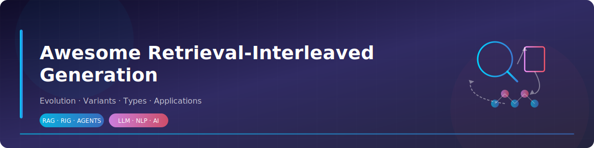
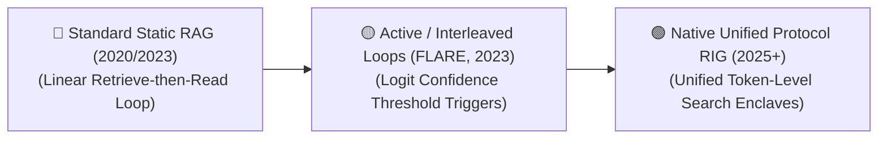

# 🚀 Awesome Retrieval-Interleaved Generation (RIG)

**A curated, authoritative knowledge base tracking the evolution, algorithmic variants, architectural modalities, production challenges, and real-world applications of Retrieval-Interleaved Generation (RIG) — the next-generation paradigm beyond static RAG.**

---

## 📖 Table of Contents

- [1. The Chronological Evolution ⏳](#1-the-chronological-evolution-)
- [2. Core Functional & Algorithmic Variants ⚙️](#2-core-functional--algorithmic-variants-️)
- [3. Structural Integration & Verification Modalities 🔗](#3-structural-integration--verification-modalities-)
- [4. Production Engineering Challenges & Mitigations 🛠️](#4-production-engineering-challenges--mitigations-️)
- [5. Frontier Real-World AI Applications 🌍](#5-frontier-real-world-ai-applications-)
- [Detailed Pages 📚](#detailed-pages-)
- [Star History ⭐](#star-history-)

---

## 🔍 What is Retrieval-Interleaved Generation?

**Retrieval-Interleaved Generation (RIG)** — also referred to as Interleaved Retrieval and Generation or Active/Dynamic RAG — is an advanced architectural paradigm that combines real-time data retrieval with the token generation process of Large Language Models (LLMs). Standard Retrieval-Augmented Generation (RAG) follows a linear, rigid "Retrieve-then-Read" loop: documents are fetched entirely *before* the model starts writing. RIG breaks this constraint by allowing the LLM to actively decide **when**, **what**, and **how often** to query external knowledge bases *while* it is actively streaming its response. This tight coupling eliminates long context inflation, dynamically verifies factual claims token-by-token, and allows the model to handle complex, multi-hop reasoning tasks with high operational accuracy.

---

## 1. The Chronological Evolution ⏳

The technical integration of dynamic database queries within generation pipelines has transitioned from fixed-interval sweeps to agentic tool triggers and native, token-level interleaved retrievals.

| # | Concept | Year | Original Paper |
|:--:|:--------|:----:|:---------------|
| 1 | **The Static Pipeline Baseline (Standard RAG)** — Formally established as a one-shot process. The user prompt goes straight to an embedding model, the top *K* document chunks are pulled, and they are dumped statically into the context window as a massive text block before the LLM generates a single character. Highly inefficient for multi-step reasoning. | 2020 | [Retrieval-Augmented Generation for Knowledge-Intensive NLP Tasks](https://arxiv.org/abs/2005.11401) — *Lewis et al., NeurIPS 2020* |
| 2 | **The Active Confidence-Triggered Era (FLARE / Self-RAG)** — Introduced conditional, active retrieval. **FLARE** tracks the model's output generation confidence at runtime. If logit probability falls below a threshold, the system pauses token generation, looks up data, and rewrites the sentence. **Self-RAG** uses reflection tokens for adaptive retrieval and self-critique. | 2023 | [Active Retrieval Augmented Generation (FLARE)](https://arxiv.org/abs/2305.06983) — *Jiang et al., EMNLP 2023* · [Self-RAG: Learning to Retrieve, Generate, and Critique through Self-Reflection](https://arxiv.org/abs/2310.11511) — *Asai et al., 2023* |
| 3 | **The Native Token-Level Protocol Era (~2025–Present)** — RIG embedded natively within core model weights via **Model Context Protocol (MCP)** or special tool-calling attention matrices. The model naturally emits specialized structural search tokens (e.g., `<\|search_call\|>`) to interleave real-time facts directly into its internal hidden layers during unified generation. | 2022–2025 | [Improving language models by retrieving from trillions of tokens (RETRO)](https://arxiv.org/abs/2112.04426) — *Borgeaud et al., ICML 2022* · [Knowing When to Ask — Bridging Large Language Models and Data (DataGemma RIG)](https://arxiv.org/abs/2409.13741) — *Radhakrishnan et al., 2024* |

> 📖 **Deep dives:** [Page 1](./assets/pages/01-static-pipeline-baseline.md) · [Page 2](./assets/pages/02-active-confidence-triggered.md) · [Page 3](./assets/pages/03-native-token-level-protocol.md)

---

## 2. Core Functional & Algorithmic Variants ⚙️

Retrieval-Interleaved architectures are strictly categorized based on the decision-making trigger that initiates a mid-generation database call.

| # | Concept | Year | Original Paper |
|:--:|:--------|:----:|:---------------|
| 4 | **Confidence-Driven Interleaved Generation** — Continuously monitors the model's internal token output log-probabilities (perplexities) during sampling. A generation dip below a target boundary (e.g., *p* < 0.35) triggers a localized vector lookup step to correct the facts. | 2023 | [Active Retrieval Augmented Generation (FLARE)](https://arxiv.org/abs/2305.06983) — *Jiang et al., EMNLP 2023* |
| 5 | **Token-Driven / Explicit Command RIG** — The model undergoes Supervised Fine-Tuning (SFT) to use search as a native tool. When encountering an objective claim or fact verification milestone, the model directly prints out specialized search primitives into its context string. | 2023 | [Toolformer: Language Models Can Teach Themselves to Use Tools](https://arxiv.org/abs/2302.04761) — *Schick et al., 2023* |
| 6 | **Fixed-Interval Sliding Window Retrieval** — A deterministic runtime configuration. The model automatically triggers a short, localized vector database lookahead sweep at unchanging intervals (e.g., exactly once every 32 or 64 generated tokens), updating its prompt context smoothly. | 2022 | [Improving language models by retrieving from trillions of tokens (RETRO)](https://arxiv.org/abs/2112.04426) — *Borgeaud et al., ICML 2022* |

> 📖 **Deep dives:** [Page 4](./assets/pages/04-confidence-driven.md) · [Page 5](./assets/pages/05-token-driven-explicit-command.md) · [Page 6](./assets/pages/06-fixed-interval-sliding-window.md)

---

## 3. Structural Integration & Verification Modalities 🔗

Depending on how the retrieved text data is injected back into the processing layers, RIG follows distinct multi-step execution layouts.

| # | Concept | Year | Original Paper |
|:--:|:--------|:----:|:---------------|
| 7 | **Linear Interleaved Append (Text-Level)** — The external database response is appended directly to the end of the existing prompt history text string, and the model re-runs its forward pass to continue generation. Highly reproducible and compatible with any commercial cloud API wrapper. | 2020 | [Retrieval-Augmented Generation for Knowledge-Intensive NLP Tasks](https://arxiv.org/abs/2005.11401) — *Lewis et al., NeurIPS 2020* |
| 8 | **Cross-Attention Memory Injection (Layer-Level)** — Bypasses text editing entirely. The retrieved chunks are converted to vectors and fed straight into specialized cross-attention hidden layers within the model architecture. Preserves the base context window length, protecting processing speed by preventing token budget inflation. | 2022 | [Improving language models by retrieving from trillions of tokens (RETRO)](https://arxiv.org/abs/2112.04426) — *Borgeaud et al., ICML 2022* |
| 9 | **Multi-Agent Multimodal Interleaved Generation (RAG-IG)** — Blends text generation with visual asset injection. The model outputs markdown text containing dynamic placeholders, interleaving real-time asset retrieval queries concurrently to output structurally cohesive multi-media documents. | 2025 | [RAG-IGBench: Innovative Evaluation for RAG-based Interleaved Generation](https://arxiv.org/abs/2512.05119) — *Zhang et al., NeurIPS 2025* |

> 📖 **Deep dives:** [Page 7](./assets/pages/07-linear-interleaved-append.md) · [Page 8](./assets/pages/08-cross-attention-memory-injection.md) · [Page 9](./assets/pages/09-multi-agent-multimodal.md)

---

## 4. Production Engineering Challenges & Mitigations 🛠️

Deploying retrieval-interleaved pipelines into high-volume commercial systems introduces critical computing bottlenecks and latency loops.

| # | Concept | Year | Original Paper |
|:--:|:--------|:----:|:---------------|
| 10 | **The Time-to-First-Token (TTFT) and Latency Inflation Penalty** — Because the model must frequently halt generation mid-sentence to execute a network database lookup, the overall token-per-second generation speed drops. **Mitigation:** *Speculative Retrieval-Decoding* — a smaller, ultra-fast draft model runs lookahead token generations to pre-fetch potential search vectors in the background before the massive target model hits the validation checkpoint. | 2024 | [Speculative RAG: Enhancing Retrieval Augmented Generation through Drafting](https://arxiv.org/abs/2407.08223) — *Wang et al., 2024* |
| 11 | **The Infinite Search Loop Vulnerability** — If the model generates a factually complex or controversial claim that the underlying vector store lacks, the model can enter a deceptive validation loop—repeatedly emitting search queries, receiving unhelpful results, and failing to exit the generation step. **Mitigation:** Hardcoding a strict *Maximum Hop Count constraint* (K ≤ 3) within the runtime serving engine, forcing the model to fallback to standard parametric generation if a query remains unresolved. | 2024 | [AI Agent Engineering for Robust RAG](https://arxiv.org/abs/2409.05899) — *Agentic RAG Systems, 2024* · [LangGraph Framework](https://langchain-ai.github.io/langgraph/) |

> 📖 **Deep dives:** [Page 10](./assets/pages/10-ttft-latency.md) · [Page 11](./assets/pages/11-infinite-search-loop.md)

---

## 5. Frontier Real-World AI Applications 🌍

| # | Concept | Year | Original Paper |
|:--:|:--------|:----:|:---------------|
| 12 | **Autonomous Financial Portfolio & Equity Audit Workflows** — Tracks volatile market updates. As a financial analyst model calculates quarterly asset risk summaries, the RIG engine dynamically looks up changing stock ticker prices and SEC filing forms, interleaving exact, real-time fiscal metrics into the sentence text. | 2026 | [Point-in-Time Financial RAG with Frozen LLMs and Market-Feedback Adaptive Retrieval](https://arxiv.org/abs/2605.31201) — *Zhao & Welsch, MIT 2026* |
| 13 | **Live Legal Case & Regulatory Compliance Trackers** — Drafts legal briefs. When referencing historical precedents, the model actively queries municipal court repositories mid-sentence to ensure citations, active appeals status, and judicial notes are completely accurate before finalizing paragraphs. | 2025 | [Towards Reliable Retrieval in RAG Systems for Large Legal Datasets](https://arxiv.org/abs/2510.06999) — *Reuter et al., 2025* |
| 14 | **Interactive Medical Diagnostic Decision Support Tools** — Clinical assistants cross-referencing patient records. While generating a proposed multi-drug treatment course, the model interleaves real-time lookups across biomedical pharmacology databases to cross-check counter-indications and dosage limits instantly. | 2024 | [MedRAG: Benchmarking Retrieval-Augmented Generation for Medicine](https://arxiv.org/abs/2502.04413) — *Xiong et al., ACL 2024* · [i-MedRAG: Improving Retrieval-Augmented Generation with Iterative Follow-up Questions](https://www.worldscientific.com/doi/10.1142/9789819807024_0015) — *Xiong et al., PSB 2025* |

> 📖 **Deep dives:** [Page 12](./assets/pages/12-financial-portfolio.md) · [Page 13](./assets/pages/13-legal-compliance.md) · [Page 14](./assets/pages/14-medical-diagnostic.md)

---

## 📚 Detailed Pages

For in-depth information, diagrams, and extended analysis of each concept, visit the dedicated pages:

| # | Topic | Page |
|:--:|:------|:----:|
| 1 | 🏗️ The Static Pipeline Baseline (Standard RAG) | [📄 Read more](./assets/pages/01-static-pipeline-baseline.md) |
| 2 | 🔥 The Active Confidence-Triggered Era (FLARE / Self-RAG) | [📄 Read more](./assets/pages/02-active-confidence-triggered.md) |
| 3 | 🧬 The Native Token-Level Protocol Era | [📄 Read more](./assets/pages/03-native-token-level-protocol.md) |
| 4 | 📊 Confidence-Driven Interleaved Generation | [📄 Read more](./assets/pages/04-confidence-driven.md) |
| 5 | ⌨️ Token-Driven / Explicit Command RIG | [📄 Read more](./assets/pages/05-token-driven-explicit-command.md) |
| 6 | 🔄 Fixed-Interval Sliding Window Retrieval | [📄 Read more](./assets/pages/06-fixed-interval-sliding-window.md) |
| 7 | 📝 Linear Interleaved Append (Text-Level) | [📄 Read more](./assets/pages/07-linear-interleaved-append.md) |
| 8 | 🧠 Cross-Attention Memory Injection (Layer-Level) | [📄 Read more](./assets/pages/08-cross-attention-memory-injection.md) |
| 9 | 🎨 Multi-Agent Multimodal Interleaved Generation (RAG-IG) | [📄 Read more](./assets/pages/09-multi-agent-multimodal.md) |
| 10 | ⏱️ The TTFT and Latency Inflation Penalty | [📄 Read more](./assets/pages/10-ttft-latency.md) |
| 11 | ♾️ The Infinite Search Loop Vulnerability | [📄 Read more](./assets/pages/11-infinite-search-loop.md) |
| 12 | 💰 Autonomous Financial Portfolio & Equity Audit Workflows | [📄 Read more](./assets/pages/12-financial-portfolio.md) |
| 13 | ⚖️ Live Legal Case & Regulatory Compliance Trackers | [📄 Read more](./assets/pages/13-legal-compliance.md) |
| 14 | 🏥 Interactive Medical Diagnostic Decision Support Tools | [📄 Read more](./assets/pages/14-medical-diagnostic.md) |

---

## 🤝 Contributing

Contributions are welcome! Feel free to open issues or submit pull requests to add new papers, correct information, or improve the documentation.

---

## 📄 License

This project is licensed under the MIT License — see the [LICENSE](LICENSE) file for details.

---

## ⭐ Star History

  <a href="https://www.star-history.com/?repos=ishandutta2007%2FAwesome-Retrieval-Interleaved-Generation&type=date&legend=bottom-right">
    <picture>
      <source media="(prefers-color-scheme: dark)" srcset="https://api.star-history.com/chart?repos=ishandutta2007/Awesome-Retrieval-Interleaved-Generation&type=date&theme=dark&legend=bottom-right" />
      <source media="(prefers-color-scheme: light)" srcset="https://api.star-history.com/chart?repos=ishandutta2007/Awesome-Retrieval-Interleaved-Generation&type=date&legend=bottom-right" />
      
    </picture>
  </a>

