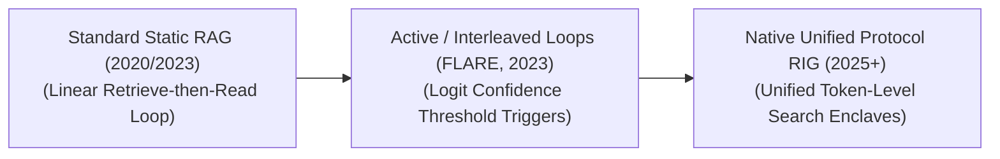

# Awesome-Retrieval-Interleaved-Generation
## Retrieval-Interleaved Generation (RIG): Evolution, Variants, Types, & Applications

Retrieval-Interleaved Generation (RIG)—also referred to as Interleaved Retrieval and Generation or Active/Dynamic RAG—is an advanced architectural paradigm that combines real-time data retrieval with the token generation process of Large Language Models (LLMs). Standard Retrieval-Augmented Generation (RAG) follows a linear, rigid "Retrieve-then-Read" loop: documents are fetched entirely *before* the model starts writing. RIG breaks this constraint by allowing the LLM to actively decide when, what, and how often to query external knowledge bases *while* it is actively streaming its response. This tight coupling eliminates long context inflation, dynamically verifies factual claims token-by-token, and allows the model to handle complex, multi-hop reasoning tasks with high operational accuracy.

---

## 1. The Chronological Evolution

The technical integration of dynamic database queries within generation pipelines has transitioned from fixed-interval sweeps to agentic tool triggers and native, token-level interleaved retrievals.

*   **The Static Pipeline Baseline (Standard RAG, ~2020–2023)**
    *   *Concept:* Formally established as a one-shot process. The user prompt goes straight to an embedding model, the top $K$ document chunks are pulled, and they are dumped statically into the context window as a massive text block before the LLM generates a single character.
    *   *Limitation:* Highly inefficient for multi-step reasoning. The system cannot look up fresh data mid-response if the generation pathway shifts semantically.
*   **The Active Confidence-Triggered Era (FLARE / Self-RAG, ~2023–2025)**
    *   *Concept:* Introduced conditional, active retrieval. Algorithms like **FLARE (Forward-Looking Active Retrieval)** track the model's output generation confidence at runtime. If the logit probability of a generating sentence falls below a strict threshold (signaling a potential hallucination), the system pauses token generation, generates a lookup query based on the predicted tokens, fetches data, and rewrites the sentence.
    *   *Limitation:* Heavy API orchestration overhead, slow processing loops, and fragile regex text parsing dependencies.
*   **The Native Token-Level Protocol Era (~2025–Present)**
    *   *Concept:* The current modern state-of-the-art framework. RIG is embedded natively within the core weights of the model via **Model Context Protocol (MCP)** or special tool-calling attention matrices. Instead of evaluating confidence thresholds post-hoc, the model naturally emits specialized structural search tokens (e.g., `<|search_call|>`) to interleave real-time facts directly into its internal hidden layers during unified generation.

---

## 2. Core Functional & Algorithmic Variants

Retrieval-Interleaved architectures are strictly categorized based on the decision-making trigger that initiates a mid-generation database call.

*   **Confidence-Driven Interleaved Generation**
    *   *Mechanism:* Continuously monitors the model’s internal token output log-probabilities (perplexities) during sampling. A generation dip below a target boundary (e.g., $p < 0.35$) triggers a localized vector lookup step to correct the facts.
*   **Token-Driven / Explicit Command RIG**
    *   *Mechanism:* The model undergoes Supervised Fine-Tuning (SFT) to use search as a native tool. When encountering an objective claim or fact verification milestone, the model directly prints out specialized search primitives into its context string.
*   **Fixed-Interval Sliding Window Retrieval**
    *   *Mechanism:* A deterministic runtime configuration. The model automatically triggers a short, localized vector database lookahead sweep at unchanging intervals (e.g., exactly once every 32 or 64 generated tokens), updating its prompt context smoothly.

---

## 3. Structural Integration & Verification Modalities

Depending on how the retrieved text data is injected back into the processing layers, RIG follows distinct multi-step execution layouts.

*   **Linear Interleaved Append (Text-Level)**
    *   *Mechanism:* The external database response is appended directly to the end of the existing prompt history text string, and the model re-runs its forward pass to continue generation.
    *   *Pros:* Highly reproducible and compatible with any commercial cloud API wrapper.
*   **Cross-Attention Memory Injection (Layer-Level)**
    *   *Mechanism:* Bypasses text editing entirely. The retrieved chunks are converted to vectors and fed straight into specialized cross-attention hidden layers within the model architecture.
    *   *Pros:* Preserves the base context window length, protecting processing speed by preventing token budget inflation.
*   **Multi-Agent Multimodal Interleaved Generation (RAG-IG)**
    *   *Mechanism:* Blends text generation with visual asset injection. The model outputs markdown text containing dynamic placeholders, interleaving real-time asset retrieval queries concurrently to output structurally cohesive multi-media documents.

---

## 4. Production Engineering Challenges & Mitigations

Deploying retrieval-interleaved pipelines into high-volume commercial systems introduces critical computing bottlenecks and latency loops.

*   **The Time-to-First-Token (TTFT) and Latency Inflation Penalty**
    *   *The Problem:* Because the model must frequently halt generation mid-sentence to execute a network database lookup, the overall token-per-second generation speed drops, creating a laggy user experience.
    *   *Mitigation:* Implementing **Speculative Retrieval-Decoding**. A smaller, ultra-fast draft model runs lookahead token generations to pre-fetch potential search vectors in the background before the massive target model hits the validation checkpoint.
*   **The Infinite Search Loop Vulnerability**
    *   *The Problem:* If the model generates a factually complex or controversial claim that the underlying vector store lacks, the model can enter a deceptive validation loop—repeatedly emitting search queries, receiving unhelpful results, and failing to exit the generation step.
    *   *Mitigation:* Hardcoding a strict **Maximum Hop Count constraint** ($K \le 3$) within the runtime serving engine, forcing the model to fallback to standard parametric generation if a query remains unresolved.

---

## 5. Frontier Real-World AI Applications

*   **Autonomous Financial Portfolio & Equity Audit Workflows**
    *   *Application:* Tracks volatile market updates. As a financial analyst model calculates quarterly asset risk summaries, the RIG engine dynamically looks up changing stock ticker prices and SEC filing forms, interleaving exact, real-time fiscal metrics into the sentence text.
*   **Live Legal Case & Regulatory Compliance Trackers**
    *   *Application:* Drafts legal briefs. When referencing historical precedents, the model actively queries municipal court repositories mid-sentence to ensure citations, active appeals status, and judicial notes are completely accurate before finalizing paragraphs.
*   **Interactive Medical Diagnostic Decision Support Tools**
    *   *Application:* Clinical assistants cross-referencing patient records. While generating a proposed multi-drug treatment course, the model interleaves real-time lookups across biomedical pharmacology databases to cross-check counter-indications and dosage limits instantly.

