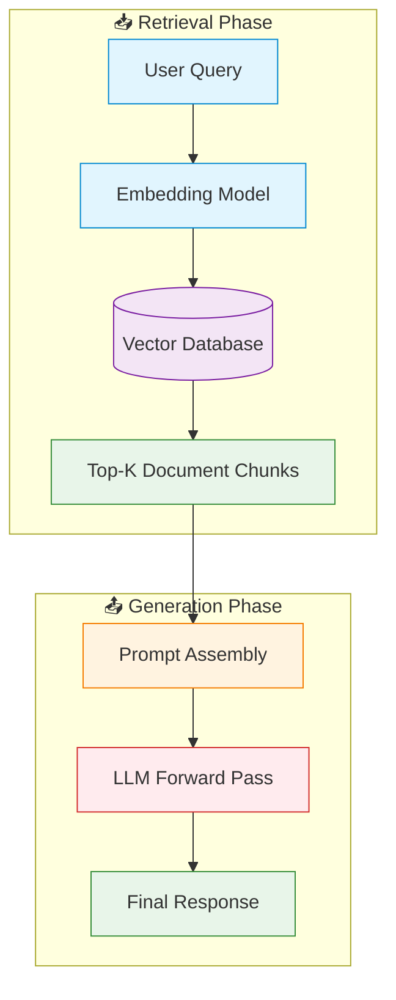

# 🏗️ The Static Pipeline Baseline (Standard RAG)

> **First introduced:** 2020 | **Paper:** [Retrieval-Augmented Generation for Knowledge-Intensive NLP Tasks](https://arxiv.org/abs/2005.11401) — *Lewis et al., NeurIPS 2020*

## Overview

The Static Pipeline Baseline — formally known as **Standard RAG (Retrieval-Augmented Generation)** — was first proposed by Lewis et al. (2020) at Facebook AI Research. It established the foundational "Retrieve-then-Read" paradigm that underpins virtually all modern retrieval-augmented language model architectures.

## Architecture Diagram

## How It Works

### 1️⃣ Query Encoding
The user's input prompt is passed through an embedding model (e.g., BERT, Sentence-BERT) to generate a dense vector representation that captures the semantic meaning of the query.

### 2️⃣ Document Retrieval
The query vector is used to search a pre-indexed vector database (e.g., FAISS, Pinecone, Weaviate) containing embeddings of document chunks. The top *K* most semantically similar chunks are retrieved.

### 3️⃣ Context Augmentation
The retrieved document chunks are concatenated with the original user query to form an augmented prompt. This static block of text is then passed to the LLM as context.

### 4️⃣ Response Generation
The LLM processes the augmented prompt in a single forward pass and generates the final response based on both its parametric knowledge and the provided external context.

## Limitations

| Limitation | Description |
|:-----------|:------------|
| ❌ **No Mid-Generation Retrieval** | The model cannot query for new information once generation begins. |
| ❌ **Context Window Bloat** | Retrieved chunks are dumped wholesale into the prompt, wasting tokens on irrelevant content. |
| ❌ **Single-Hop Only** | Cannot perform multi-step reasoning that requires iterative fact-checking. |
| ❌ **Static Knowledge** | If the initial retrieval is poor or misses key information, the generation is fundamentally limited. |
| ❌ **Information Overload** | Large volumes of retrieved text can confuse the model (lost-in-the-middle effect). |

## Legacy & Impact

Despite its limitations, the Standard RAG pipeline remains the most widely deployed RAG architecture in production systems due to its simplicity, reproducibility, and compatibility with any commercial LLM API. It laid the groundwork for all subsequent retrieval-interleaved innovations.

---

**[⬆ Back to README](../README.md)**
