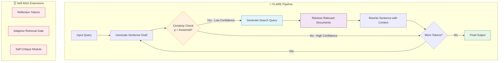

# 🔥 The Active Confidence-Triggered Era (FLARE / Self-RAG)

> **First introduced:** 2023 | **Papers:** [FLARE (Active Retrieval Augmented Generation)](https://arxiv.org/abs/2305.06983) — *Jiang et al., EMNLP 2023* · [Self-RAG](https://arxiv.org/abs/2310.11511) — *Asai et al., 2023*

## Overview

The Active Confidence-Triggered Era marks a paradigm shift from static one-shot retrieval to **conditional, dynamic retrieval**. Two landmark papers — **FLARE** and **Self-RAG** — independently pioneered the concept of using the model's internal state to decide *when* to retrieve information during generation.

## Architecture Diagram

## How FLARE Works

### 1️⃣ Draft Generation
The LLM first generates a preliminary sentence or phrase based on its parametric knowledge.

### 2️⃣ Confidence Evaluation
Each generated token's logit probability is monitored. If the overall sentence confidence falls below a threshold (e.g., *p* < 0.35), the system flags potential hallucination.

### 3️⃣ Forward-Looking Query
The low-confidence sentence is used as a search query to retrieve relevant external information.

### 4️⃣ Rewriting
The sentence is re-generated with the retrieved context, ensuring factual accuracy.

## How Self-RAG Extends This

Self-RAG introduces **reflection tokens** — special tokens that the model emits to signal retrieval needs, evaluate relevance of retrieved passages, and critique its own outputs. This makes the retrieval decision entirely learned rather than threshold-based.

## Key Breakthroughs

| Innovation | Description |
|:-----------|:------------|
| 🎯 **Conditional Retrieval** | Retrieval only triggers when the model is uncertain. |
| 📉 **Reduced Hallucination** | Active verification catches factual errors mid-generation. |
| 🔄 **Multi-Hop Capability** | Multiple retrieval steps can be chained for complex reasoning. |
| 🪞 **Self-Reflection** (Self-RAG) | The model critiques its own outputs for quality control. |

## Limitations

| Limitation | Description |
|:-----------|:------------|
| 🐌 **Latency Overhead** | Pausing generation for retrieval adds significant delay. |
| 🔧 **Threshold Sensitivity** | FLARE's performance depends on hardcoded confidence thresholds. |
| 📝 **Regex Dependency** | Early implementations relied on fragile text parsing. |
| 💰 **API Cost** | Each retrieval pause means additional API calls. |

---

**[⬆ Back to README](../README.md)**
