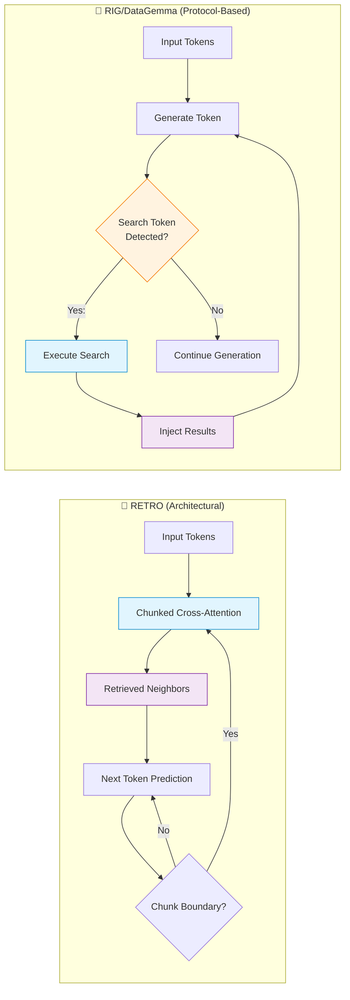

# 🧬 The Native Token-Level Protocol Era

> **First introduced:** 2022–2025 | **Papers:** [RETRO](https://arxiv.org/abs/2112.04426) — *Borgeaud et al., ICML 2022* · [DataGemma RIG](https://arxiv.org/abs/2409.13741) — *Radhakrishnan et al., 2024*

## Overview

The Native Token-Level Protocol Era represents the current state-of-the-art in retrieval-interleaved generation. Unlike earlier approaches that rely on post-hoc confidence thresholds or external orchestration, this paradigm embeds retrieval capabilities directly into the model architecture through specialized tokens and attention mechanisms.

## Architecture Diagram

## Key Approaches

### RETRO (Retrieval-Enhanced Transformer) — 2022
**DeepMind's** architectural innovation that integrates retrieval into the transformer's cross-attention layers. The model processes input in fixed-size chunks (64 tokens), and for each chunk, retrieves relevant neighbor passages from an external corpus. These are injected via specialized **Chunked Cross-Attention (CCA)** layers.

### DataGemma RIG — 2024
**Google's** protocol-based approach where the model is fine-tuned to emit special `<search>` tokens when it needs external data. The generation is paused, a search is executed against Data Commons, and the results are injected back into the context.

### Model Context Protocol (MCP) — 2025
**Anthropic's** standardized API protocol for model-to-resource communication. While not a neural-level integration, MCP standardizes how models interact with external tools and data sources, enabling seamless interleaved retrieval.

## Comparison

| Feature | RETRO | DataGemma RIG | MCP |
|:--------|:------|:--------------|:----|
| **Approach** | Architectural cross-attention | Fine-tuned tool/query tokens | Standardized API protocol |
| **Interleaving Level** | Native, per-chunk (neural) | Proactive, per-call (agentic) | Interface/Infrastructure layer |
| **Core Intent** | Scaling memory capacity | Grounding facts with data | Standardizing data connectivity |
| **Context Impact** | No prompt bloat | Minimal prompt addition | Configurable |
| **Framework** | Custom architecture | Gemma 2 fine-tuning | Protocol-agnostic |

## Advantages

- ✅ **No context window inflation** — retrieved data is injected at the layer level
- ✅ **Natural interleaving** — the model learns when to retrieve
- ✅ **Multi-hop reasoning** — native support for sequential retrievals
- ✅ **Reduced latency** — no need for external orchestration frameworks

---

**[⬆ Back to README](../README.md)**
