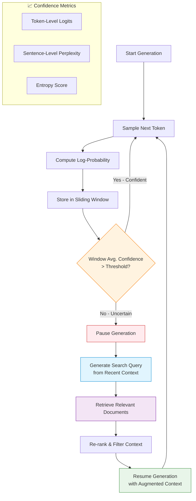

# 📊 Confidence-Driven Interleaved Generation

> **First introduced:** 2023 | **Paper:** [Active Retrieval Augmented Generation (FLARE)](https://arxiv.org/abs/2305.06983) — *Jiang et al., EMNLP 2023*

## Overview

Confidence-Driven Interleaved Generation continuously monitors the model's internal token output log-probabilities (perplexities) during sampling. When generation confidence dips below a target boundary, it triggers a localized vector lookup to correct facts in real-time.

## Architecture Diagram

## How It Works

### 1️⃣ Token Generation Monitoring
The system tracks the log-probability of each generated token. A sliding window (typically 5–10 tokens) maintains a running average of token confidence.

### 2️⃣ Uncertainty Detection
When the average confidence drops below a threshold (e.g., *p* < 0.35), the system infers that the model is operating outside its knowledge boundary.

### 3️⃣ Query Construction
The recently generated low-confidence tokens are used to formulate a targeted search query for the vector database.

### 4️⃣ Localized Retrieval
Only the most relevant document chunks are retrieved, minimizing context pollution.

### 5️⃣ Fact Verification
The sentence is re-generated with the retrieved context, ensuring that the final output is factually grounded.

## Key Advantages

- 🎯 **Selective retrieval** — only triggers when necessary, reducing overhead
- 📉 **Reduced hallucination** — catches factual errors as they occur
- 🔄 **Adaptable** — naturally handles multi-hop reasoning
- 📊 **Quantifiable** — confidence thresholds can be tuned per use case

## Challenges

- 🔧 **Threshold tuning** — optimal thresholds vary by domain and model
- 🐌 **Generation pauses** — each retrieval step adds latency
- 📝 **Query quality** — depends on the model's ability to formulate good search queries

---

**[⬆ Back to README](../README.md)**
