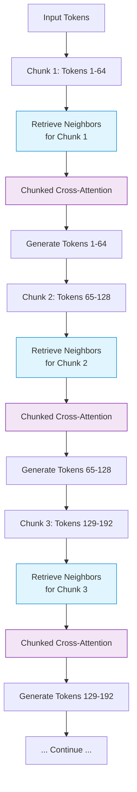

# 🔄 Fixed-Interval Sliding Window Retrieval

> **First introduced:** 2022 | **Paper:** [Improving language models by retrieving from trillions of tokens (RETRO)](https://arxiv.org/abs/2112.04426) — *Borgeaud et al., ICML 2022*

## Overview

Fixed-Interval Sliding Window Retrieval is a deterministic approach where the model triggers a localized vector database lookahead sweep at unchanging intervals (e.g., every 32 or 64 generated tokens). This pattern, pioneered by the RETRO architecture, provides consistent, periodic context updates without complex confidence thresholding.

## Architecture Diagram

## How It Works

### 1️⃣ Chunking
The input and generated text is divided into fixed-size chunks — typically 64 tokens in RETRO. This chunk boundary becomes the natural retrieval checkpoint.

### 2️⃣ Neighbor Retrieval
For each chunk, the system retrieves the most relevant neighbor passages from an external database of trillions of tokens. These neighbors are encoded and prepared for cross-attention.

### 3️⃣ Chunked Cross-Attention (CCA)
A specialized attention mechanism processes the retrieved neighbors alongside the current chunk. Unlike standard cross-attention, CCA is computationally efficient because each chunk only attends to its own retrieved neighbors, not all tokens.

### 4️⃣ Continuous Generation
The model generates the next chunk of tokens conditioned on both the previous context and the retrieved information. The process repeats at each chunk boundary.

## Key Advantages

| Advantage | Description |
|:----------|:------------|
| 🔄 **Deterministic** | Fixed intervals provide predictable latency and retrieval behavior. |
| 📊 **Tunable** | Interval length can be adjusted for cost/quality tradeoffs. |
| 🔗 **Natural Multi-Hop** | Each chunk boundary is a natural reasoning checkpoint. |
| 📉 **Compute Efficient** | CCA only attends to retrieved neighbors, not all tokens. |

## Comparison: Fixed vs. Adaptive Retrieval

| Aspect | Fixed-Interval | Adaptive (Confidence-Driven) |
|:-------|:---------------|:-----------------------------|
| **Retrieval Trigger** | Every N tokens | When confidence drops |
| **Predictability** | High | Variable |
| **Optimal for** | Consistent quality needs | Cost-sensitive deployments |
| **Complexity** | Low | Medium |
| **Overhead** | Uniform | Variable |

## Modern Extensions

- **PipeRAG (2024)** — Introduces pipeline parallelism to decouple retrieval from generation, using flexible intervals rather than strictly fixed ones.

---

**[⬆ Back to README](../README.md)**
