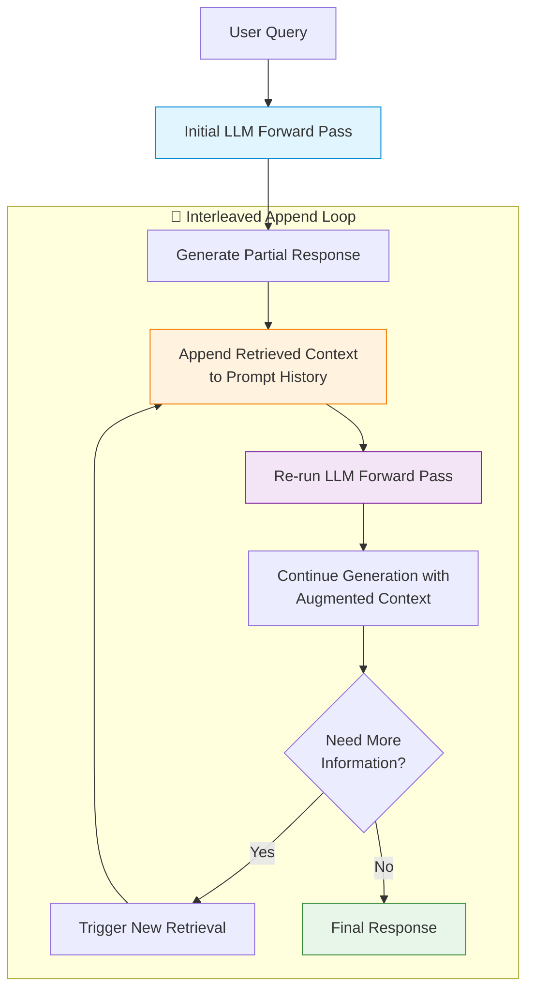

# 📝 Linear Interleaved Append (Text-Level)

> **First introduced:** 2020 | **Paper:** [Retrieval-Augmented Generation for Knowledge-Intensive NLP Tasks](https://arxiv.org/abs/2005.11401) — *Lewis et al., NeurIPS 2020*

## Overview

Linear Interleaved Append is the simplest and most widely deployed form of retrieval-interleaved generation. The external database response is appended directly to the end of the existing prompt history text string, and the model re-runs its forward pass to continue generation. This approach is highly reproducible and compatible with any commercial cloud API wrapper.

## Architecture Diagram



## How It Works

### 1️⃣ Initial Generation
The LLM begins generating a response based on the user query and its parametric knowledge.

### 2️⃣ Retrieval Trigger
At a designated point (either fixed interval, confidence-based, or explicit command), a retrieval call is made to the external knowledge base.

### 3️⃣ Text Concatenation
The retrieved documents are converted to text and appended to the existing conversation history:
```
User: What is the current stock price of AAPL?
Assistant: Based on the latest data, [RETRIEVAL TRIGGERED]
Retrieved: AAPL current price: $178.25 (as of 2024-01-15)
Assistant: Based on the latest data, Apple's stock is trading at $178.25.
```

### 4️⃣ Re-Generation
The model processes the updated prompt from the beginning (or a cached prefix) and continues generating with the new context available.

## Advantages

| Advantage | Description |
|:----------|:------------|
| ✅ **Universally Compatible** | Works with any LLM API (OpenAI, Anthropic, open-source, etc.) |
| ✅ **Simple to Implement** | No architectural changes needed — just prompt engineering |
| ✅ **Transparent** | The full context is visible and debuggable |
| ✅ **Reproducible** | Same inputs always produce the same augmented prompt |

## Limitations

| Limitation | Description |
|:-----------|:------------|
| ❌ **Context Window Inflation** | Each retrieval adds tokens, eventually hitting context limits |
| ❌ **Computational Waste** | Re-processing the full prompt on each retrieval is expensive |
| ❌ **Lost-in-the-Middle** | Retrieved content in the middle of long prompts may be ignored |
| ❌ **Latency** | Each append requires a full re-run of the model |

## Production Considerations

- **Context Budgeting** — track total token usage and implement sliding windows
- **Caching** — use KV-cache when available to avoid full recomputation
- **Position Bias** — place the most important retrieved content at the start or end of the prompt

---

**[⬆ Back to README](../README.md)**
