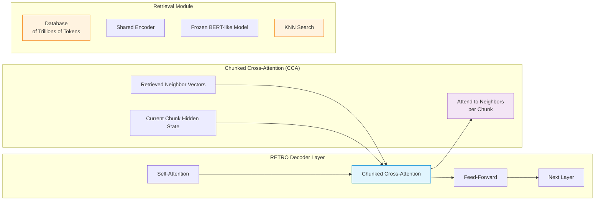

# 🧠 Cross-Attention Memory Injection (Layer-Level)

> **First introduced:** 2022 | **Paper:** [Improving language models by retrieving from trillions of tokens (RETRO)](https://arxiv.org/abs/2112.04426) — *Borgeaud et al., ICML 2022*

## Overview

Cross-Attention Memory Injection bypasses text editing entirely. Retrieved document chunks are converted to dense vector representations and fed directly into specialized cross-attention hidden layers within the model architecture. This preserves the base context window length, protecting processing speed by preventing token budget inflation.

## Architecture Diagram

```mermaid
flowchart TB
    subgraph "📥 Traditional Text-Level"
        A1[User Query] --> A2[Retrieve Docs]
        A2 --> A3[Append as Text]
        A3 --> A4[Process with LLM]
        A4 --> A5[/!\ Context Window Grows]
    end

    subgraph "🧠 Layer-Level (RETRO)"
        B1[User Query] --> B2[Retrieve Docs]
        B2 --> B3[Encode to Vectors]
        B3 --> B4[Inject into<br/>Cross-Attention Layers]
        B4 --> B5[Process with LLM]
        B5 --> B6[/ ✓ Context Preserved]
    end

    style A4 fill:#ffebee,stroke:#d32f2f
    style A5 fill:#ffebee,stroke:#d32f2f
    style B4 fill:#e1f5fe,stroke:#0288d1
    style B5 fill:#e8f5e9,stroke:#388e3c
    style B6 fill:#e8f5e9,stroke:#388e3c
```

## Detailed Architecture



## How It Works

### 1️⃣ Chunking
The input is divided into fixed-size chunks (typically 64 tokens). Each chunk becomes both a retrieval unit and a cross-attention segment.

### 2️⃣ Neighbor Retrieval
For each chunk, the system searches an external database (containing trillions of tokens) for the most relevant neighbor passages using K-Nearest Neighbors search.

### 3️⃣ Encoding
The retrieved passages are encoded using a shared encoder (a frozen BERT-like model) into dense vector representations.

### 4️⃣ Chunked Cross-Attention (CCA)
Instead of standard cross-attention over all retrieved tokens, RETRO's CCA mechanism allows each chunk to attend only to its own retrieved neighbors. This is computationally efficient and scales linearly with the number of chunks.

### 5️⃣ Autoregressive Generation
The model generates text chunk by chunk, with each step conditioned on both the previous context and the layer-injected retrieved vectors.

## Advantages Over Text-Level Injection

| Aspect | Text-Level Append | Layer-Level Injection |
|:-------|:-----------------|:---------------------|
| 📏 **Context Length** | Grows with each retrieval | Stays constant |
| ⚡ **Compute Cost** | Increases with context | Fixed per layer |
| 🎯 **Attention Focus** | Model must find relevant info | Pre-focused on retrieved data |
| 🔌 **API Compatibility** | Works with any LLM | Requires architectural changes |
| 📈 **Scalability** | Limited by context window | Scales to trillion-token corpora |

## Impact

RETRO's layer-level injection demonstrated that language models could effectively leverage databases orders of magnitude larger than their context window, achieving GPT-3-level performance with 25× fewer parameters.

---

**[⬆ Back to README](../README.md)**
