# ⏱️ The Time-to-First-Token (TTFT) and Latency Inflation Penalty

> **Mitigation introduced:** 2024 | **Paper:** [Speculative RAG: Enhancing Retrieval Augmented Generation through Drafting](https://arxiv.org/abs/2407.08223) — *Wang et al., 2024*

## Overview

Because the model must frequently halt generation mid-sentence to execute network database lookups, the overall tokens-per-second generation speed drops, creating a laggy user experience. The key mitigation — **Speculative Retrieval-Decoding** — uses a smaller, ultra-fast draft model to run lookahead token generations and pre-fetch potential search vectors in the background.

## Architecture Diagram

```mermaid
flowchart TB
    subgraph "❌ Without Speculative Decoding"
        A1[Start Generation] --> A2[Generate Tokens]
        A2 --> A3[Block on Retrieval]
        A3 --> A4[Resume Generation]
        A4 --> A5[Block on Retrieval]
        A5 --> A6[... High Latency ...]
    end

    subgraph "✅ With Speculative Retrieval-Decoding"
        B1[Start Generation] --> B2[Large Model<br/>Generates Tokens]
        B2 --> B3{Draft Model<br/>Pre-fetches Vectors}
        B3 --> B4[Large Model<br/>Validates Tokens]
        B4 --> B5[Parallel Retrieval<br/>in Background]
        B5 --> B2
    end

    subgraph "⚡ Draft Model Pipeline"
        C1[Recent Context] --> C2[Small Draft Model]
        C2 --> C3[Predict Next N Tokens]
        C3 --> C4[Extract Potential<br/>Search Queries]
        C4 --> C5[Pre-fetch Retrieved<br/>Documents]
        C5 --> C6{Cache Ready<br/>for Main Model?}
        C6 -->|Yes| C7[Instant Injection]
        C6 -->|No| C8[Fallback to<br/>Standard Retrieval]
    end

    style A3 fill:#ffebee,stroke:#d32f2f
    style A5 fill:#ffebee,stroke:#d32f2f
    style B5 fill:#e1f5fe,stroke:#0288d1
    style C2 fill:#fff3e0,stroke:#f57c00
    style C7 fill:#e8f5e9,stroke:#388e3c
```

## The Latency Problem

### Why RIG Introduces Latency

| Factor | Impact |
|:-------|:-------|
| 🔍 **Network Lookups** | Each retrieval adds 50–500ms of network latency |
| 🧠 **Context Re-encoding** | Appending retrieved content requires re-processing |
| 🔄 **Generation Pauses** | Model must stop and wait for data |
| 📊 **Multi-Hop Chains** | Multiple retrievals compound the latency |

### TTFT Degradation

In standard RAG, TTFT is ~1× (one retrieval before generation). In RIG systems, TTFT can grow to **2–10×** depending on the number of interleaved retrieval steps.

## Speculative Retrieval-Decoding

### How It Works

1. **Draft Model** — A small, fast model (e.g., 7B parameters vs. 70B) runs continuously in parallel with the main model.

2. **Lookahead Prediction** — The draft model predicts the next 5–10 tokens and identifies potential search needs.

3. **Pre-fetching** — Based on the draft predictions, the system initiates retrieval requests before the main model needs the data.

4. **Cache Validation** — Retrieved documents are cached. When the main model triggers a search, the data is already available in most cases.

### Performance Gains

| Metric | Without Speculation | With Speculation | Improvement |
|:-------|:-------------------|:-----------------|:------------|
| ⏱️ **Average TTFT** | 850ms | 420ms | **~50% reduction** |
| 📈 **Tokens/Second** | 15 | 28 | **~87% improvement** |
| 🔄 **Retrieval Overlap** | Sequential | Parallel | **2× throughput** |

## Other Mitigation Strategies

| Strategy | Description | Effectiveness |
|:---------|:------------|:--------------|
| 🗃️ **KV-Cache Optimization** | Cache attention states to avoid re-computation | Medium |
| 🌐 **Faster Vector Search** | Use HNSW or other approximate nearest neighbor algorithms | Medium |
| 📦 **Batch Retrieval** | Group multiple retrievals into a single batch request | High |
| 🎯 **Adaptive Intervals** | Only retrieve when confidence drops, not on fixed schedule | High |

---

**[⬆ Back to README](../README.md)**
