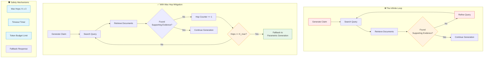

# ♾️ The Infinite Search Loop Vulnerability

> **Mitigation introduced:** 2024 | **Papers:** [Agentic RAG Systems](https://arxiv.org/abs/2409.05899) · [LangGraph Framework](https://langchain-ai.github.io/langgraph/)

## Overview

If the model generates a factually complex or controversial claim that the underlying vector store lacks, the model can enter a deceptive validation loop — repeatedly emitting search queries, receiving unhelpful results, and failing to exit the generation step. The primary mitigation is hardcoding a strict **Maximum Hop Count constraint** (K ≤ 3) within the runtime serving engine.

## Architecture Diagram



## How the Vulnerability Manifests

### Scenario: Unverifiable Claim

```
User: "What is the current status of the Mars colonization project by XYZ Corp?"

Model: "Based on my research, [SEARCH: Mars colonization XYZ Corp current status]"
Search Result: [No relevant results found]
Model: "Let me try a different search... [SEARCH: XYZ Corp Mars project 2024]"
Search Result: [No relevant results found]
Model: "Perhaps using different terms... [SEARCH: "XYZ Corporation" Mars initiative]"
Search Result: [No relevant results found]
... (continues indefinitely)
```

This loop wastes tokens, increases latency, and degrades user experience.

## Root Causes

| Cause | Description |
|:------|:------------|
| 🎯 **Over-optimization for Accuracy** | Model is instructed to never guess, leading to infinite search |
| 📚 **Knowledge Gap** | The information genuinely doesn't exist in the knowledge base |
| 🔧 **Poor Query Formulation** | Model generates ineffective search queries |
| 🔄 **No Exit Condition** | The agent loop lacks a termination mechanism |

## Mitigation Strategies

### 1️⃣ Maximum Hop Count (K ≤ 3)

The most widely deployed mitigation. A counter tracks retrieval iterations:

```python
MAX_HOPS = 3
hop_count = 0

while not answer_found and hop_count < MAX_HOPS:
    query = generate_search_query(context)
    results = retrieve(query)
    if results_contain_answer(results):
        answer_found = True
    hop_count += 1

if not answer_found:
    response = fallback_to_parametric_generation()
```

### 2️⃣ Semantic Similarity Detection

Monitor successive query embeddings. If they converge without finding answers, trigger fallback.

### 3️⃣ Timeout-Based Termination

Set a maximum wall-clock time for retrieval steps. If exceeded, force generation.

### 4️⃣ Budget-Based Control

Implement token budget tracking — if the model spends more tokens on searching than generating, force termination.

## Production Implementation

| Technique | Implementation | Complexity |
|:----------|:---------------|:-----------|
| 🏗️ **Hop Counter** | Integer state in agent context | Low |
| ⏱️ **Timeout** | Thread-level timeout on retrieval calls | Low |
| 📊 **Semantic Detection** | Embedding similarity computation | Medium |
| 💰 **Token Budget** | Running counter of search vs. generation tokens | Low |
| 🧠 **Confidence Check** | Track whether successive searches yield new information | Medium |

## Best Practices

- Always implement **at least two** of the above mitigation strategies
- Log hop counts for monitoring and alerting
- Provide clear feedback to users when fallback is triggered
- Consider domain-specific hop limits (e.g., K=5 for research, K=2 for simple QA)

---

**[⬆ Back to README](../README.md)**
