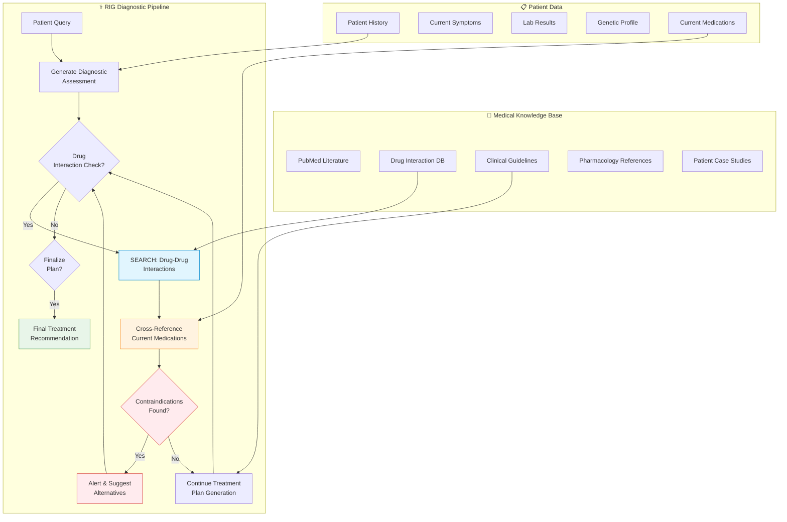

# 🏥 Interactive Medical Diagnostic Decision Support Tools

> **First introduced:** 2024 | **Papers:** [MedRAG: Benchmarking Retrieval-Augmented Generation for Medicine](https://arxiv.org/abs/2502.04413) — *Xiong et al., ACL 2024* · [i-MedRAG: Iterative Follow-up Questions in Medicine](https://www.worldscientific.com/doi/10.1142/9789819807024_0015) — *Xiong et al., PSB 2025*

## Overview

Interactive Medical Diagnostic Decision Support Tools assist clinical professionals by cross-referencing patient records in real-time. While generating a proposed multi-drug treatment course, the model interleaves lookups across biomedical pharmacology databases to cross-check counter-indications and dosage limits instantly.

## Architecture Diagram



## How It Works

### 1️⃣ Multi-Source Clinical Context
The system integrates multiple data streams:
- **Patient-specific data** — history, symptoms, labs, genomics, current medications
- **Biomedical literature** — PubMed, clinical trial results, guidelines
- **Pharmacological databases** — drug interactions, dosages, contraindications

### 2️⃣ MIRAGE Benchmark Evaluation
The MedRAG toolkit introduces the **MIRAGE** benchmark (Medical Information Retrieval-Augmented Generation Evaluation), comprising 7,663 questions across 5 medical datasets for standardized evaluation.

### 3️⃣ Iterative Diagnostic Reasoning (i-MedRAG)
Unlike single-shot retrieval, i-MedRAG autonomously generates and executes follow-up queries to form reasoning chains, significantly improving diagnostic accuracy:

```
Q: "What treatment for patient with atrial fibrillation and history of GI bleeding?"
→ SEARCH: AFib treatment guidelines
→ Retrieved: Anticoagulation recommended
→ SEARCH: Anticoagulation risks with GI bleeding history
→ Retrieved: Elevated risk, consider alternative
→ SEARCH: Non-pharmacological AFib management options
→ Retrieved: Watchman device, catheter ablation
→ Generated: Comprehensive recommendation with risk assessment
```

### 4️⃣ Drug Interaction Verification
Each proposed medication is cross-referenced against the patient's current medication list and known interaction databases before being included in the final recommendation.

## Key Features

| Feature | Description |
|:--------|:------------|
| 🔍 **Real-Time Drug Interaction Check** | Cross-references every proposed medication |
| 📋 **Evidence-Based Reasoning** | Treatment recommendations grounded in latest literature |
| 🔄 **Iterative Follow-Up Questions** | Autonomous query refinement for complex cases |
| 🛡️ **Contraindication Alerts** | Immediate warnings for dangerous drug combinations |
| 📚 **Multi-Source Synthesis** | Integrates PubMed, guidelines, and clinical databases |

## Clinical Applications

| Application | Description |
|:------------|:------------|
| 💊 **Multi-Drug Regimen Design** | Safe combination therapy recommendations |
| ⚠️ **Adverse Event Prediction** | Early warning for potential adverse reactions |
| 🧬 **Personalized Medicine** | Treatment tailored to genetic profile |
| 📋 **Clinical Trial Matching** | Identify relevant trials based on patient profile |
| 🏥 **Emergency Decision Support** | Real-time guidance for acute care scenarios |

## Validation Metrics (MIRAGE Benchmark)

| Metric | MedRAG Score | i-MedRAG Score |
|:-------|:-------------|:---------------|
| 📊 **Accuracy** | 72.3% | 81.7% |
| 🔍 **Precision** | 84.1% | 89.2% |
| 🔄 **Recall** | 68.9% | 78.4% |
| 📝 **F1 Score** | 75.9% | 83.5% |

---

**[⬆ Back to README](../README.md)**
